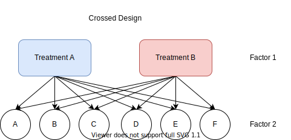

```{r, include = FALSE}
knitr::opts_chunk$set(
  collapse = TRUE,
  cache = TRUE,
  comment = "#>"
)
```

The BiometryTraining package handles a number of common experimental designs, however sometimes things require a little more nuance. This vignette will demonstrate how to generate a more complex factorial experimental design.

We'll start by loading the BiometryTraining package:

```{r setup}
library(BiometryTraining)
```

## Factorial designs

Factorial designs are where there is more than one treatment factor that is applied to experimental units. They can be *nested*, where a subgroup of treatments from one factor all occur with a subset of treatments from another factor, or *crossed*, where all the treatments from one factor co-occur with all treatments from another factor. See the figures below for a visual representation of this concept. In both cases there are two factors, and factor 1 has two treatment levels (A and B), while factor 2 has 6 treatment levels (A to F).

```{r nested_diagram, echo = F, fig.align='center', fig.cap="Figure 1: A nested factorial design with two factors"}

```

```{r crossed_diagram, echo = F, fig.align='center', fig.cap="Figure 2: A crossed factorial design with two factors"}

```


## Randomisation

The label "factorial design" actually only provides part of the required information to generate a factorial design. While a crossed or nested factorial design explains how the treatment levels appear together, it doesn't tell us what type of randomisation is applied to those treatments. The BiometryTraining package supports completely randomised (CRD), randomised complete block (RCBD) and Latin square randomisations of factorial designs.

## Generating designs

For examples of simple nested and crossed factorial designs, see the examples in the `design()` function. Biometry Training supports factorial designs with up to three factors, in either crossed or nested configurations. 

### A complex factorial design

Consider the following case: A researcher is investigating the effect of a biological control on the plant growth due when in the presence of the fungal pathogen [Rhizoctonia](https://en.wikipedia.org/wiki/Rhizoctonia). There are three treatments in this experiment which are crossed; the first is the type of biological control with two levels which we will label "A" and "B". The second is the method of application, again with two levels, being "foliar" (sprayed on leaves) or "seed", where the treatment is applied directly to the seed. The third is the rate of application, which consists of three levels, which will be labeled 1, 2, and 3. So to summarise we have:

- Biological control with 2 levels (A and B)
- Application method with 2 levels (foliar and seed)
- Rate of application with 3 levels (1, 2, and 3)

Combining these treatment levels would give $2 \times 2 \times 3 = 12$ treatments in total. However, the researcher would like to compare the effect of the treatment to some control treatments to enable estimation of a treatment effect. Hence, there are three additional treatments, which are an untreated control with no treatments applied, and no innoculation of Rhizoctonia, and two controls which have been innoculated with Rhizoctonia and will have water applied via foliar spray and applied to the seed, but no other treatments. So in total we have 15 treatments with the addition of these three control treatments.
